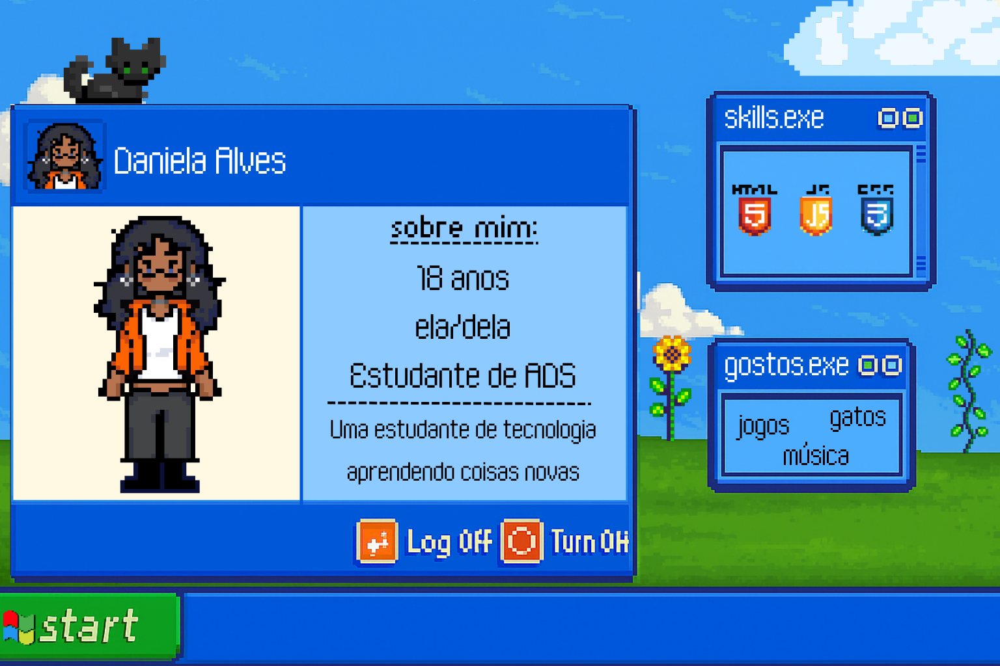

<h1 align="center">Olá! Sou a Daniela⭐</h1>

  

  
 <b> 🤔 Sobre mim </b> <i>(Clique aqui)</i> 

   
  <ul>
    <li>🌍 Me chamo Daniela Alves, tenho 18 anos e sou do Brasil. Focada em me tornar uma desenvolvedora web full-stack.</li>
    <li>💻 Estudo Desenvolvimento Web para iOS e adoro criar interfaces modernas e responsivas com HTML, CSS e JavaScript.</li>
    <li>🎓 Também sou estudante de Análise e Desenvolvimento de Sistemas na FAM — com conhecimentos em C e C++.</li>
    <li>🚀 Me formei no PROA (maio de 2025), onde desenvolvi tanto habilidades técnicas quanto comportamentais.</li>
    <li>🎮 Curiosidade: Amo Jogos, Gatos e toco guitarra🎸</li>
  </ul>

  
 <b> :mailbox: Contato </b> <i>(Clique aqui)</i> 

   
  Estou aberta a novas oportunidades, colaborações ou apenas um bom papo sobre tecnologia e ideias.  

  
